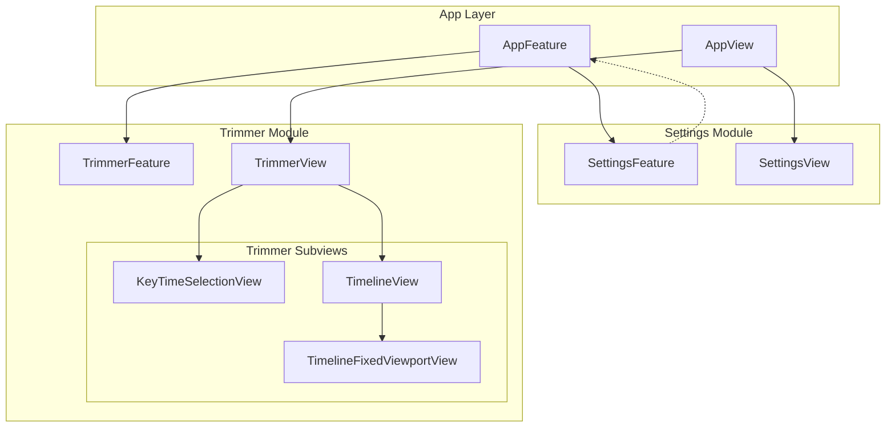
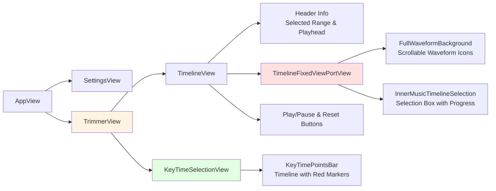
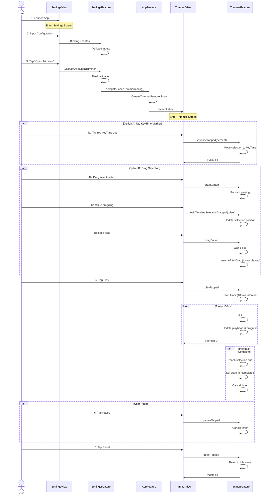

# AudioTrimmer - iOS Audio Trimmer Homework

A SwiftUI-based audio trimmer application built with The Composable Architecture (TCA), featuring intuitive timeline manipulation and keyframe navigation.

## 📱 Demo
| Settings | Trimmer |
| ----------- | ----------- |
|  |  | 

## Features

### Settings Configuration
- Configurable total track length (seconds)
- Multiple keyTime points as percentages (0-100%)
- Adjustable timeline selection length (percentage of total)
- Input validation with real-time feedback

### Audio Trimmer
- Play/Pause selected audio segment
- Reset playback to start
- Drag to adjust selection window
- Tap keyTime markers to jump to specific positions
- Real-time progress visualization
- Waveform visualization with fixed viewport


## Architecture Overview

This project follows **The Composable Architecture (TCA)** principles for predictable state management and testable code.

### Architecture Diagram



## TCA Features Breakdown

### AppFeature
**Responsibility**: Root coordinator managing navigation and feature integration

```swift
State:
  - settings: SettingsFeature.State
  - trimmer: TrimmerFeature.State? (@Presents)

Actions:
  - settings(SettingsFeature.Action)
  - trimmer(PresentationAction<TrimmerFeature.Action>)

Key Logic:
  - Handles delegate actions from SettingsFeature
  - Presents TrimmerFeature with validated configuration
```

### SettingsFeature
**Responsibility**: Configuration and validation

```swift
State:
  - totalLengthSeconds: Double
  - musicTimelineSelectionLengthPercent: Double
  - keyTimePercents: [Double]

Actions:
  - binding (BindingAction)
  - validateAndOpenTrimmer
  - delegate(Delegate)

Key Logic:
  - Real-time input validation
  - Sends .openTrimmer delegate action to parent
```

### TrimmerFeature
**Responsibility**: Audio trimming logic and playback simulation

```swift
State:
  - config: TrimmerConfiguration
  - musicTimelineSelection: ClosedRange<Double>
  - playhead: Double
  - playState: PlayState (.idle/.playing/.paused/.completed)
  - playedProgress: Double

Actions:
  - playTapped / pauseTapped / resetTapped
  - keyTimeTapped(Double)
  - musicTimelineSelectionDragged(offset: Double)
  - dragStarted / dragEnded
  - tick (100ms interval)

Key Logic:
  - Playback simulation with timer
  - Selection window drag with clamping
  - Auto-resume after drag delay (1 sec)
  - KeyTime navigation with boundary checking
```

## View Hierarchy



## User Flow

### Complete User Journey



